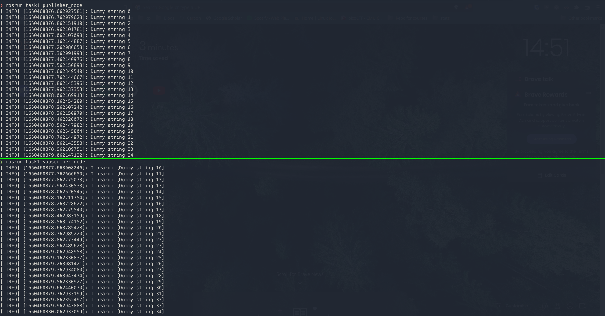
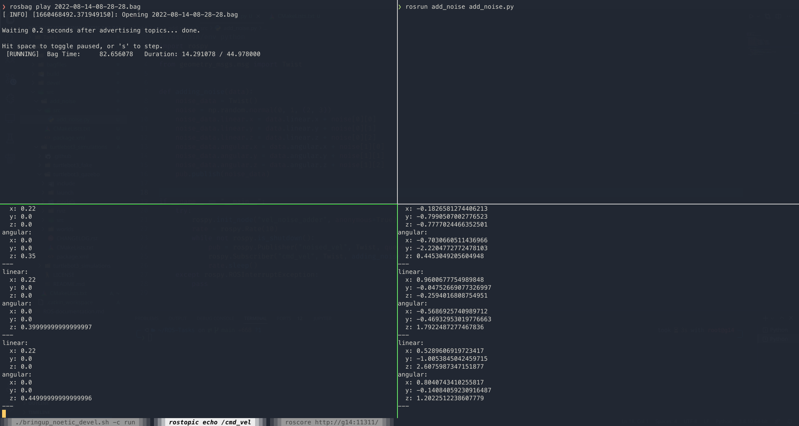

# Task 1

- Run `roscore`

On a separate terminal window
```bash
cd Task1
source ./devel/setup.bash   # or source ./devel/setup.zsh
rosrun task1 publisher_node.cpp
```
On another separate terminal window
```bash
source Task1/devel/setup.bash   # or source ./devel/setup.zsh
rosrun task1 subscriber_node.cpp
```
### Sample output


# Task 2

## Controlling the bot and recording the `.bag` file

```bash
cd Task2
source ./devel/setup.bash # or source ./devel/setup.zsh
export TURTLEBOT3_MODEL=burger
roslaunch turtlebot3_gazebo turtlebot3_empty_world.launch
```
Open another terminal window
```bash
source Task2/devel/setup.bash # or source Task2/devel/setup.zsh
roslaunch turtlebot3_teleop turtlebot3_teleop_key.launch
```
Open another terminal window
```bash
cd Task2/bagfiles
rosbag record -a
```

## Adding noise to velocity and publishing it in to new topic

Open 4 separate terminal windows and source the proper setup file
```bash
source Task2/devel/setup.bash # or source Task2/devel/setup.zsh
```
- Terminal 1: run `roscore`

- Terminal 2
```bash
cd Task2/bagfiles
rosbag play <bagfile>
```
- Terminal 3 (shows actual velocity)
```bash
rostopic echo /cmd_vel
```
- Terminal 4 (shows velocity with added noise)

```bash
rostopic echo /noised_vel
```
### Sample output



